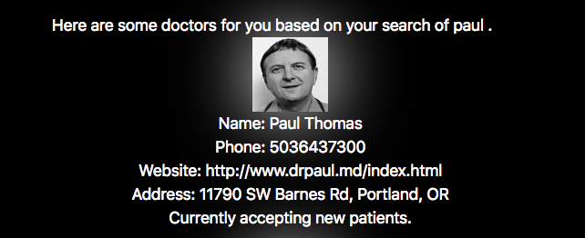

# DoctorPicker
Search by doctor name, search by medical condition! DoctorPicker has got it all!!!

## Getting Started & Requirements
* Requirements
	* Chrome browser
	* npm
	* terminal

Clone DoctorPicker to your local machine:

```
$git clone https://github.com/johnnymayer/doctorpicker
```

Run an npm install to load all dev packages and dependencies in /doctorpicker:

```
$npm install
```

Run an npm test in /doctorpicker to display output of testing results:

```
$npm run start
```

After running ```$npm run start```, a new Chrome browser will appear, displaying DoctorPicker.

## Specs

* A user should be able to enter a medical issue to receive a list of doctors in the Portland area that fit the search query.
  * Input:

    

  * Output:

    

* A user should be able to enter a name to receive a list of doctors in the Portland area that fit the search query.
* Input:

  

* Output:

  

## Built With
* Atom
* JavaScript
* npm
* webpack
* Chrome
* Postman

## Author
[Johnny Mayer](https://github.com/johnnymayer)

## License

This project is licensed under the MIT License - see the [LICENSE.md](LICENSE.md) file for details.

## Acknowledgements
* [Monster Energy](https://www.monsterenergy.com/) - Shoutout to the Mega Monster Energy 24oz can for getting me through like always.

* [AK1200](https://en.wikipedia.org/wiki/AK1200) - for another mixtape [Prepare for Assault](https://www.youtube.com/watch?v=HYL4vtonSy4)
